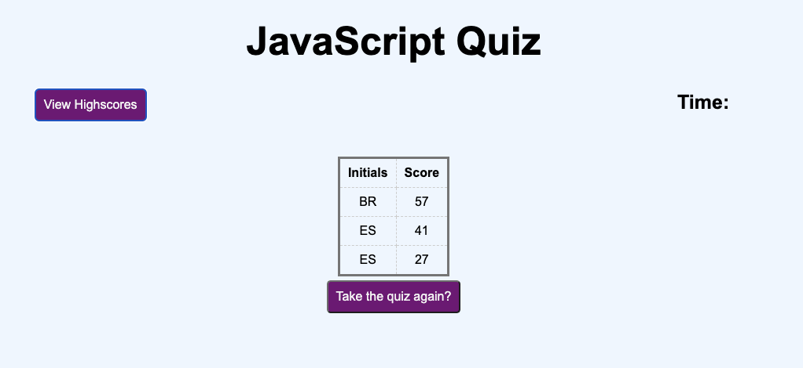

# JavaScript Quiz

This is a short quiz that I created to learn how to traverse the DOM and create more interactive JavaScript functionality. The quiz tests your knowledge of JavaScript and the DOM.

## Technologies Used

- HTML
- CSS
- JavaScript

## How to Use

To use the quiz, simply open the `index.html` file in your web browser. You will be presented with a series of questions. Select your answer for each question to see if you got the answer right. At the end of the quiz, you will see your score.

## How it Works

The quiz uses HTML to structure the content, CSS to style the page, and JavaScript to add interactivity. The JavaScript code uses DOM manipulation techniques to dynamically update the page as the user interacts with the quiz.

When the user selects an answer, the JavaScript code checks if the answer is correct and updates the page accordingly. At the end of the quiz, the JavaScript code calculates the user's score and displays it on the page, along with other scores saved in localStorage.

